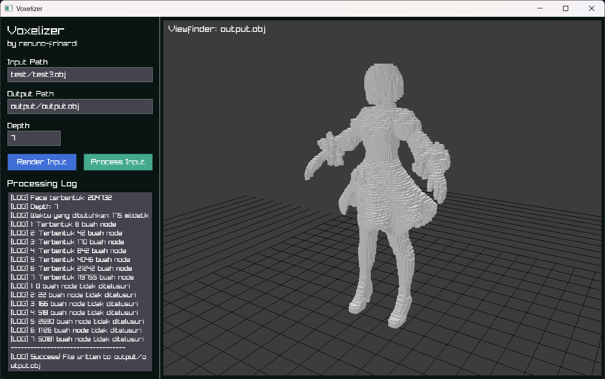

# Voxelizer [Tugas Kecil 2 IF2211 Strategi Algoritma]

 
Program Voxelizer file .obj dengan pendekatan Octree yang disertai Axis-Aligned Bounding Box (AABB). Program ditulis dengan bahasa C++ dengan dua tipe iinterface, yaitu CLI dan GUI. Untuk implementasi GUI, program menggunakan library dari RayLib dengan rendering 3d menggunakan OpenGL. Aplikasi dapat dikompilasi langsung pada dua OS berbeda, Linux dengan distro pilihannya atau Windows 11. Program telah diuji dan dijalankan pada Windows 11 juga WSL Arch Linux.

# Requirements
Sebelum melakukan kompilasi, pastikan sudah menginstall dependency sebagai berikut

## Windows
- MinGW-w64
- GCC, G++, dan Make
- Git

## Linux
- Git, Make pkg-config, GCC, G++ (Untuk kompilasi program)
- libx11, libxrandr, libxi, libxinerama, libcursor, libgl1-mesa (Dependencies dari RayLib)

# Cara menjalankan
1. Jalankan script sesuai dengan OS kalian, .sh untuk linux dan .bat untuk windows. Pilih script sesuai dengan jenis program yang diinginkan, build_gui untuk program dengan interface gui dan build untuk program cli
2. Program hasil kompilasi akan muncul di folder /bin yang nantinya akan bisa dijalankan
3. [CLI] Program ini dapat dijalankan dengan cara memanggil .exe atau bianry dengan perintah:
    - <nama executable> <path/nama-file.obj> <depth> <path/nama-output.obj>
    - Contoh: .\bin\voxelizer.exe .\test\test3.obj 7 .\output\output.obj
    - Program dapat menerima path relatif terhadap dari mana program dijalankan, program bisa juga menerima path absolute dari root OS
    - Log dari program akan muncul di terminal tempat perintah dijalankan
4. [GUI] Program ini dapat dijalankan dengan cara merun executable yang nantinya akan membuka sebuah GUI
    - Masukkan input path sesuai dengan lokasi dari file .obj (dapat berupa path relatif terhadap asal program dijalankan atau path absolute dari os)
    - Masukkan juga lokasi output dari file nantinya
    - Klik tombol "Render Input" untuk melihat visualisasi awal dari file .obj sebelum proses voxelizer
    - Klik tombol "Process Input" untuk menjalankan proses voxelizer dan melihat tampilannya di program
    - Process log akan muncul disebelah kiri

# Author
Program dirancang dan ditulis oleh  
Renuno Yuqa Frinardi - 13524080 - Teknik Informatika ITB 2024

# Lampiran
Asset 3D dari test didapat dari: 
1. 2B model (test3.obj) - Cyber via https://skfb.ly/onzLZ 
2. Gundam RX-79[G] (test4.obj) - zakk628 via https://skfb.ly/6WVW6 
3. test1, test2, test5 - Contoh OBJ pada Lampiran Tugas Kecil 2 IF2211 Strategi Algoritma